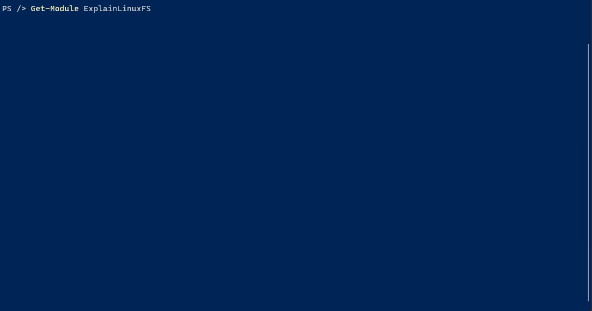

# ExplainLinuxFS

Explain LinuxFS is a fast way of getting fast info regarding the linux standard directories at the command-line.


Explains /etc
```powershell
ldexplain etc
```

Explains all standard directories
```powershell
ldexplain -all
```

Explains /etc, and sets the current working directory to /etc (Linux only)
```powershell
ldexplain etc -go
```

## Demo
